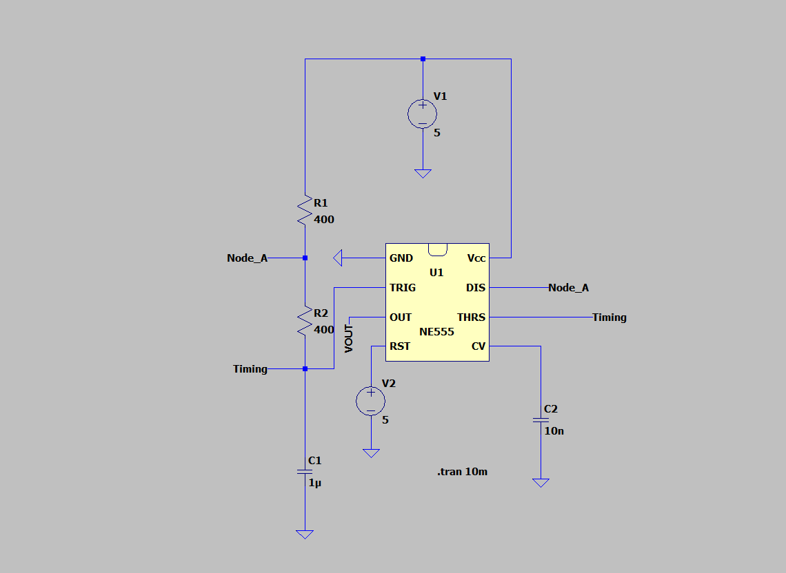
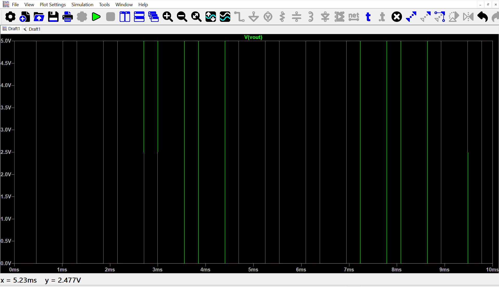

# PWM Signal Generation Using 555 Timer IC

## 📌 Project Overview

This project demonstrates the generation of a periodic pulse waveform using the **NE555 Timer IC** configured in astable mode.The circuit uses an RC timing network consisting of two resistors and a capacitor. The capacitor continuously charges and discharges, causing the 555 timer output to switch between HIGH and LOW states.The circuit is designed and verified using **LTspice simulation** before hardware implementation.

## 🎯 Objectives

- Understand the working of the NE555 Timer IC.
- Generate a periodic pulse waveform using the 555 timer in astable mode.
- Study capacitor charging and discharging in an RC timing network.
- Analyze the output waveform using LTspice.
- Calculate the theoretical frequency and duty cycle.
- Compare theoretical and simulated results.
- Implement and test the circuit on hardware.

## ⚙️ Components Used

Component - Value 

NE555 Timer IC -1
R1 - 400 Ω
R2 - 400 Ω 
C1 - 1 µF 
C2 - 10 nF 
DC Supply - 5 V 

## 🔌 Circuit Diagram

The NE555 is configured in astable mode.

### Pin Connections

NE555 Pin - Connection 

Pin 1 - GND (Ground)
Pin 2 - TRIG (Timing node)
Pin 3 - OUT (VOUT / PWM output)
Pin 4 - RST (+5 V)
Pin 5 - CV (10 nF capacitor to Ground)
Pin 6 - THRS (Timing node)
Pin 7 - DIS (R1-R2 junction)
Pin 8 - VCC (+5 V)

## 🧠 Working Principle

The capacitor C1 continuously charges and discharges through the resistor network.
During charging, the capacitor voltage rises toward **2/3 VCC**. When this level is reached, the internal comparator changes the state of the 555 timer and the output becomes LOW.The capacitor then discharges through R2. When its voltage falls to approximately **1/3 VCC**, the output becomes HIGH again.This charging and discharging process repeats continuously, producing a periodic rectangular waveform at Pin 3.

## 📐 Theoretical Calculations

For an astable 555 timer:

### HIGH Time: T_ON = 0.693 × (R1 + R2) × C1
### LOW Time: T_OFF = 0.693 × R2 × C1
### Time Period: T = T_ON + T_OFF
### Frequency: f = 1 / T
### Duty Cycle: Duty Cycle = (T_ON / T) × 100

For:
- R1 = 400 Ω
- R2 = 400 Ω
- C1 = 1 µF

The theoretical values are approximately:

T_ON = 0.554 ms
T_OFF = 0.277 ms
Time Period = 0.831 ms 
Frequency = 1.20 kHz 
Duty Cycle = 66.7% 

## 💻 LTspice Simulation

The circuit was simulated using **LTspice** with a 5 V DC supply.

### Simulation Output

The simulation produces a periodic rectangular waveform at the **VOUT** node.The output switches approximately between 0 V and 5 V.

## 📊 Simulation Results

The LTspice simulation successfully generated the expected periodic output waveform.
The simulated waveform can be analyzed to determine:
- Frequency
- Time period
- HIGH time
- LOW time
- Duty cycle
- Output voltage levels
These values will be compared with the theoretical calculations.

## 📁 Simulation File

The LTspice schematic is included in this repository:

[PWM_555.asc](PWM_555.asc)

## 🛠️ Software Used

- LTspice
- GitHub
